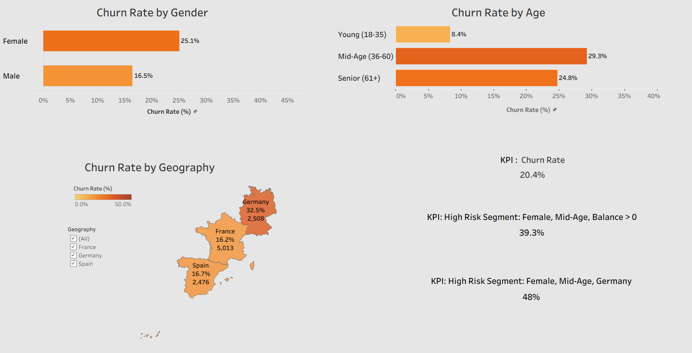
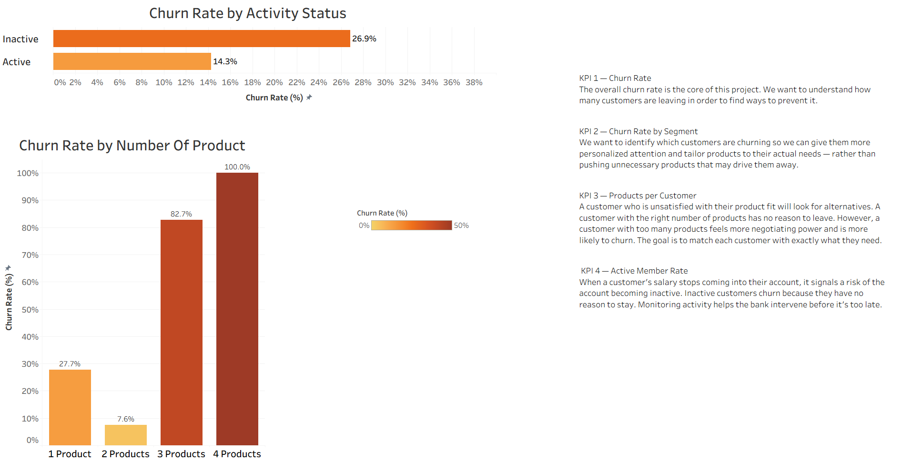

# Bank Churn Analysis 🏦

## Overview
End-to-end analysis of bank customer churn using a dataset of ~10,000 customers.  
The goal: identify which customers are most likely to leave, and why.

## Tools Used
- **Python (Pandas)** — Data cleaning & preprocessing
- **MySQL** — Exploratory data analysis (EDA)
- **Tableau** — Interactive dashboard & visualizations

## Key Findings
- Overall churn rate: **20.4%**
- Germany has the highest churn rate at **32.5%** vs ~16% in France and Spain
- Female customers churn more (**25.1%**) than male (**16.5%**)
- Middle-aged customers (36–60) show the highest churn at **29.3%**
- Customers with 3–4 products churn at extremely high rates
- Inactive members churn at **26.9%** vs **14.3%** for active members

## Highest Risk Segment 🚨
**Female customers, aged 36–60, located in Germany**  
→ Churn rate: **48%** — more than double the overall average

## Dashboards

- Customers with 3-4 products show extremely high churn rates (82.7% and 100%).
- Note: both groups are small — 266 and 60 customers respectively — insufficient to draw firm conclusions.

## Files
| File | Description |
|------|-------------|
| `Bank_Project.ipynb` | Data cleaning with Python & Pandas |
| `bank_project_sql.sql` | EDA queries in MySQL |
| `Final Project.twbx` | Tableau dashboard |
